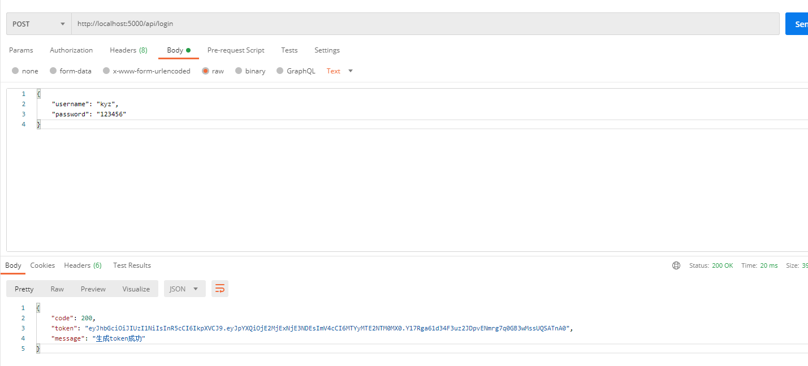
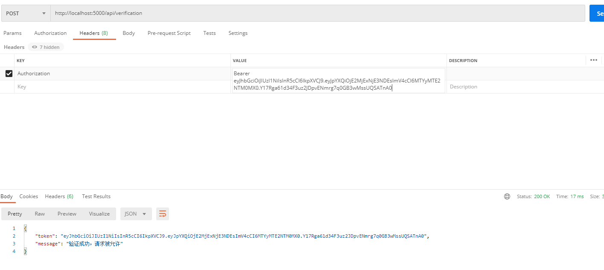

# node-jwt-authentication

#### 介绍
nodejs中使用jwt(jsonwebtoken)进行身份验证

#### 开始
* 开启本地mysql服务，然后按照配置创建对应的数据库和表
```json
{
  "host": "localhost",
  "user": "root",
  "password": "******",
  "port": "3306",
  "database": "test"
}
```

* 开启node服务
```sh
npm start
```

* 进行登陆，获取token


* 进行token验证

